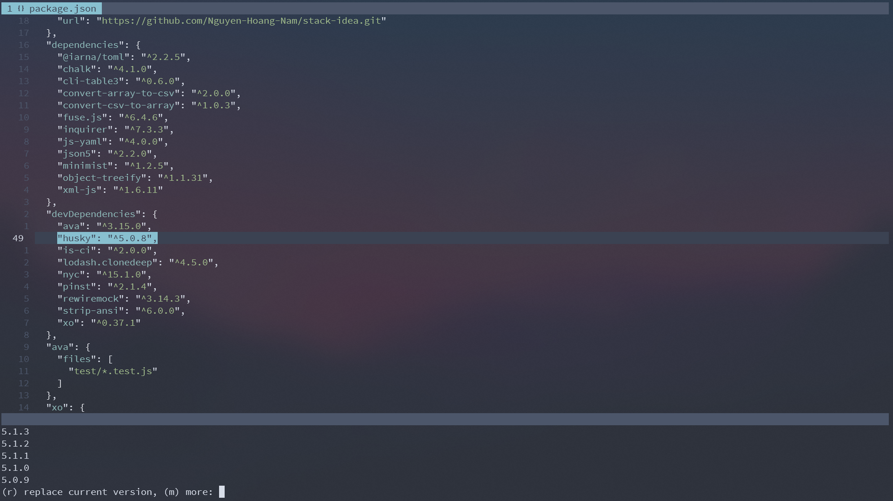

# version.vim

Check for outdated dependencies is one of the most important things to keep the projects safe. Inspirated by Version lens in Visual Studio Code, I make the small plugin to fetch versions from package manager and replace previous version.

Currently, I only support Javascript modules.

## Installation

### Using [vim-plug](https://github.com/junegunn/vim-plug)

```vim
Plug 'Nguyen-Hoang-Nam/vim-version'
```

## Commands

| Command | List |
| :--- | :--- |
| :LVersion | Get the latest version ('-r' to replace) |
| :AVersions | Get all versions |

## Usage

Put cursor at the line contain package's name and 's version. Type `:AVersions` to get the 5 latest versions then press `r` to replace version or `m` to show all versions. 



If you only care about latest version then type `:LVersion` (`-r` to replace) to get it.


## Contributing
Pull requests are welcome. For major changes, please open an issue first to discuss what you would like to change.

Please make sure to update tests as appropriate

## License
[MIT](https://choosealicense.com/licenses/mit/)
